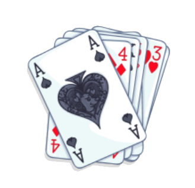

# Decks Framework


Framework API to handle the deck and cards, built in Go with Gin HttpServer

Contributors: PathToLife

### Features
- Fair Card shuffling using crypto/rand + Fisher-Yates shuffle algorithm [[oldwestaction](https://medium.com/@oldwestaction/randomness-is-hard-e085decbcbb2)]

# Quick Start

Edit/Create .env file in the project root if needed, an example is below

```dotenv
PORT=3000
DEBUG=true
```

To Run Server (defaults to port 3000, will also download dependencies and build)

`go run .`

To Run all tests

`go test ./tests`

To Build

`go build`

# API Reference

Alternatively Postman Collection: [docs/DecksFramework.postman_collection.json](docs/DecksFramework.postman_collection.json)

### Create Deck

#### POST `http://localhost:3000/deck/create`

QueryParams
- `shuffle=<true | false>` shuffles the deck
- `cards=AS,2S` comma separated list of cards

Example Return

```json
{
  "deck_id": "5f2ffb68-ce1c-430a-9141-81caa9b3204c",
  "shuffled": false,
  "remaining": 52
}
```

### Open Deck

#### GET `http://localhost:3000/deck/open?uuid={{deck_id}}`

QueryParams
- `uuid` deck_id from POST `/deck/create`

Example Return

```json
{
  "deck_id": "5f2ffb68-ce1c-430a-9141-81caa9b3204c",
  "shuffled": false,
  "remaining": 52,
  "cards": [
    {
      "value": "ACE",
      "suit": "SPADES",
      "code": "AS"
    },
    "..."
  ]
}
```

### Draw Card

#### POST `http://localhost:3000/deck/draw?uuid={{deck_id}}&count=2`

QueryParams
- `uuid` deck_id from POST `/deck/create`
- `count` number of cards to draw

Example Return

```json
{
    "cards": [
        {
            "value": "ACE",
            "suit": "SPADES",
            "code": "AS"
        },
        {
            "value": "2",
            "suit": "SPADES",
            "code": "2S"
        }
    ]
}
```

